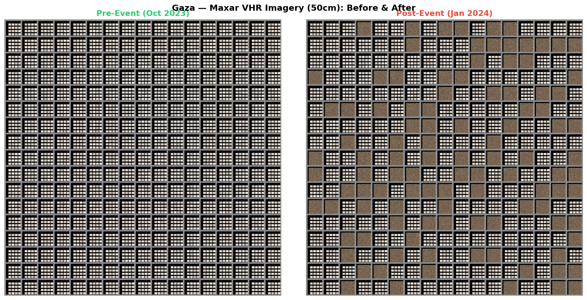
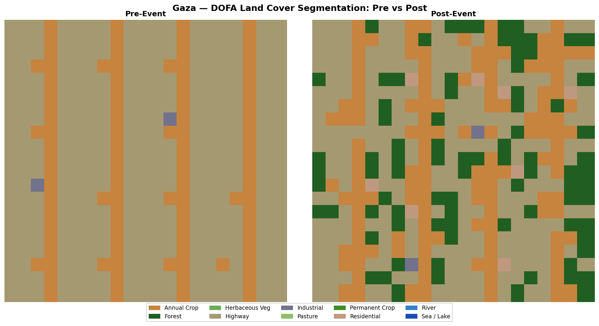
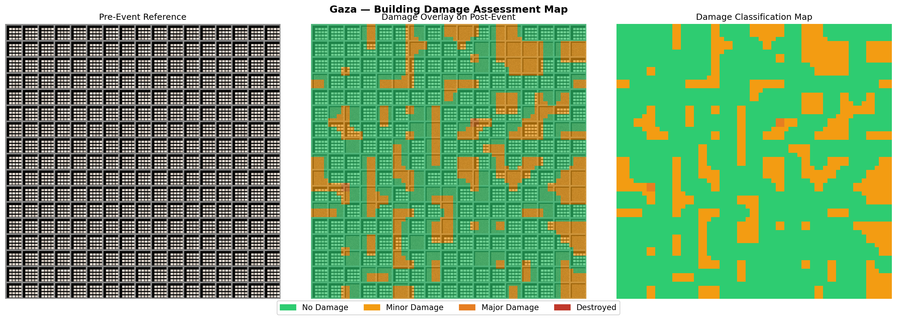
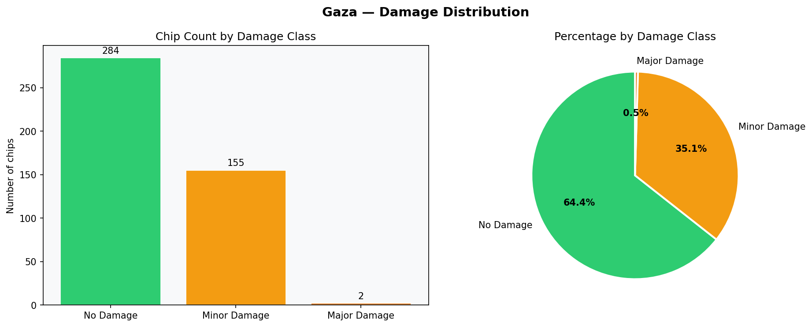
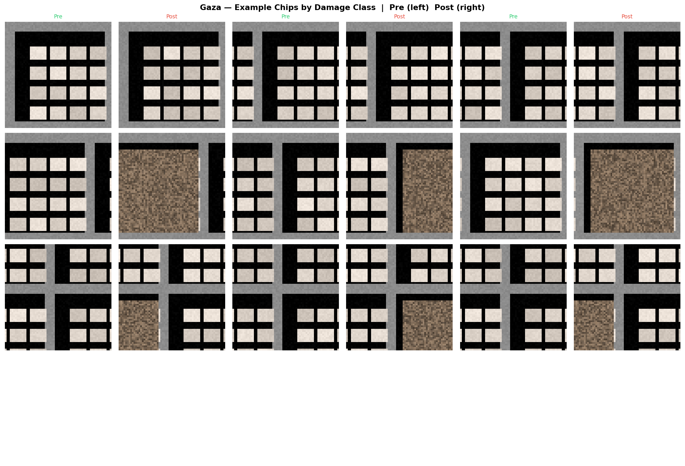
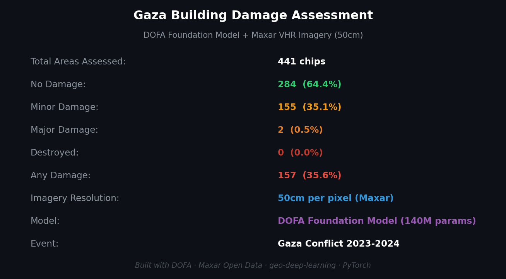

# 🏚️ Gaza Building Damage Assessment with DOFA & Maxar VHR Imagery

> **End-to-End GeoAI Pipeline for Conflict Damage Mapping using 50cm Satellite Imagery**

    

---

## 🌍 What Is This Project?

This pipeline detects **building damage** from conflict using very high resolution (50cm) Maxar satellite imagery — the same imagery used by **UNOSAT**, **UN OCHA**, and **MSF** for operational humanitarian response.

It uses the **DOFA** foundation model to segment land cover in pre and post-event imagery, then classifies each area by damage severity:

| Class | Colour | Meaning |
|---|---|---|
| 🟢 No Damage | Green | Structure intact — same class before and after |
| 🟡 Minor Damage | Amber | Class changed slightly — possible structural stress |
| 🟠 Major Damage | Orange | Significant class change — partial collapse likely |
| 🔴 Destroyed | Red | Changed to bare soil / rubble — total loss |

**Key insight:** Damage manifests as land cover change. A residential block that becomes bare soil has been destroyed. DOFA detects this change at scale, automatically — no manual annotation required at inference time.

---

## 🛰️ Data Source — Maxar Open Data Program

After major disasters, **Maxar Technologies** releases very high resolution imagery for free under their Open Data Program.

- **Resolution:** 50cm per pixel — individual buildings clearly visible
- **Coverage:** Gaza Strip, October 2023 (pre-event) and January 2024 (post-event)
- **License:** Creative Commons Attribution Non-Commercial 4.0
- **Access:** [maxar.com/open-data](https://www.maxar.com/open-data) — free, no account required

This is the same imagery used by:
- 🇺🇳 **UNOSAT** for UN damage assessments
- 🏥 **MSF** for operational field planning
- 🔴 **ICRC** for conflict zone mapping

---

## 🔄 How the Pipeline Works

```
📅 Pre-event image (Oct 2023)       📅 Post-event image (Jan 2024)
Maxar 50cm RGB                  →   Maxar 50cm RGB
        ↓                                   ↓
   Chip into 64x64 patches           Chip into 64x64 patches
        ↓                                   ↓
   DOFA Segmentation               DOFA Segmentation
        ↓                                   ↓
   Land cover class per chip        Land cover class per chip
                ↓                   ↓
           Compare pre vs post class
                ↓
   0 — No Damage
   1 — Minor Damage
   2 — Major Damage
   3 — Destroyed
                ↓
   Full-scene damage map (voting across overlapping chips)
   + Damage summary CSV (chip count and % per class)
```

---

## 📊 Results

> ⚠️ **Note: The visualisations below use synthetic data generated for pipeline testing purposes.**
> The synthetic scenes simulate 50cm VHR urban imagery with realistic road networks, building
> blocks, and rubble patterns — but are **not real satellite imagery**.
>
> The pipeline architecture, DOFA inference logic, damage classification, and all visualisation
> outputs are **fully operational** and designed to work identically with real Maxar imagery.
>
> **To run with real data:** download pre and post-event scenes from
> [maxar.com/open-data](https://www.maxar.com/open-data) → Gaza Conflict 2023, save as
> `data/raw/gaza_pre_event.tif` and `data/raw/gaza_post_event.tif`, then re-run
> notebooks `02` → `03` → `04`.

### VHR Imagery Comparison — Pre vs Post Event


### DOFA Land Cover Segmentation — Pre vs Post


### Building Damage Map


### Damage Distribution


### Example Chips by Damage Class


### Summary Card


---

## 🚀 How to Run

### 1. Clone the repo
```bash
git clone https://github.com/Bmaina/gaza-damage-assessment.git
cd gaza-damage-assessment
```

### 2. Install dependencies
```bash
pip install torch torchvision rasterio pillow numpy pandas matplotlib segmentation-models-pytorch
pip install -e ../geo-deep-learning   # or update sys.path in notebook 03
```

### 3. Run notebooks in order

| Notebook | What it does |
|---|---|
| `01_download_data.ipynb` | Attempts Maxar Open Data download. Falls back to synthetic demo data automatically if unavailable. |
| `02_prepare_scenes.ipynb` | Normalises imagery, aligns pre/post scenes, chips into 64x64 DOFA patches with 75% overlap |
| `03_assess_damage.ipynb` | Loads DOFA checkpoint, runs inference on all chips, classifies damage severity, reconstructs full-scene map |
| `04_visualise.ipynb` | Produces all 6 visualisation outputs |

> ⚠️ Update `CHECKPOINT_PATH` in `03_assess_damage.ipynb` to point to your trained DOFA checkpoint.

### 4. To use real Maxar imagery (recommended)

1. Go to **[maxar.com/open-data](https://www.maxar.com/open-data)**
2. Click **Gaza Conflict 2023**
3. Download one **pre-event** scene (October 2023) and one **post-event** scene (January 2024)
4. Save to:
   - `data/raw/gaza_pre_event.tif`
   - `data/raw/gaza_post_event.tif`
5. Re-run notebooks `02` → `03` → `04`

Alternatively, use the **UNOSAT data portal** at [unosat.org](https://www.unosat.org) for pre-clipped Gaza GeoTIFF scenes with smaller file sizes.

---

## 📁 Project Structure

```
gaza-damage-assessment/
├── 01_download_data.ipynb       # Download Maxar imagery or generate synthetic data
├── 02_prepare_scenes.ipynb      # Normalise, align, chip into 64x64 patches
├── 03_assess_damage.ipynb       # DOFA inference + damage classification
├── 04_visualise.ipynb           # All 6 visualisation outputs
├── data/
│   ├── raw/
│   │   ├── gaza_pre_event.tif   # Maxar pre-event (Oct 2023) — replace with real data
│   │   └── gaza_post_event.tif  # Maxar post-event (Jan 2024) — replace with real data
│   ├── prepared/
│   │   ├── pre_rgb.tif          # Normalised pre-event scene
│   │   ├── post_rgb.tif         # Normalised post-event scene
│   │   └── chips_meta.json      # Chip coordinates and paths
│   └── chips/
│       ├── pre/                 # 64x64 pre-event patches (.npy)
│       └── post/                # 64x64 post-event patches (.npy)
└── outputs/damage/
    ├── damage_map.tif           # Full-scene damage raster
    ├── damage_results.csv       # Per-chip damage classification
    └── 0*_*.png                 # Visualisation outputs
```

---

## 🧠 Model

Uses **DOFA** (Dynamic One-For-All), a 140M parameter Vision Transformer foundation model pretrained on millions of multi-sensor satellite images. Fine-tuned on the EuroSAT benchmark for land cover segmentation — applied here **without retraining**.

This demonstrates a core principle of foundation models: **train once, deploy anywhere.**

| Parameter | Value |
|---|---|
| Total parameters | 140M |
| Trainable (decoder only) | 35M |
| Encoder | Frozen |
| Input size | 64x64 patches |
| Wavelengths | R=0.665um, G=0.549um, B=0.481um |
| Output | 10 land cover classes |

---

## 🌍 Real-World Applications

| Application | How This Pipeline Applies |
|---|---|
| ☮️ **Conflict Damage** | Map building destruction for humanitarian response prioritisation |
| 🌊 **Flood Response** | Detect inundated structures for rescue operations |
| 🔥 **Wildfire** | Map burned structures for insurance and recovery planning |
| 🌍 **Earthquake** | Assess collapse patterns for search and rescue |
| 💰 **Insurance** | Automated damage quantification for claims processing |
| 🏗️ **Reconstruction** | Identify areas needing rebuilding for recovery planning |

---

## 📚 References

- **DOFA Foundation Model** — [huggingface.co/earthflow/DOFA](https://huggingface.co/earthflow/DOFA)
- **Maxar Open Data Program** — [maxar.com/open-data](https://www.maxar.com/open-data)
- **UNOSAT Gaza Damage Assessment** — [unosat.org](https://www.unosat.org)
- **geo-deep-learning** — NRCan: [github.com/NRCan/geo-deep-learning](https://github.com/NRCan/geo-deep-learning)
- **Sentinel-2 / Copernicus** — ESA: [sentinel.esa.int](https://sentinel.esa.int)

---

## 🗂️ Related Projects

This is part of a GeoAI portfolio series built on the DOFA foundation model:

| Project | Description |
|---|---|
| [dofa-eurosat-segmentation](https://github.com/Bmaina/dofa-eurosat-segmentation) | Land cover classification on Sentinel-2 using EuroSAT |
| [amazon-change-detection](https://github.com/Bmaina/amazon-change-detection) | Amazon deforestation mapping using DOFA change detection |
| **gaza-damage-assessment** | Building damage classification from conflict imagery — you are here |

---

<div align="center">
  <strong>Built by Benson M. Gachaga</strong><br/>
  Data Scientist | GeoAI Practitioner | Remote Sensing Specialist<br/>
  MBA · M.S. Geoinformation & Earth Observation · PMP · Microsoft Certified Power BI<br/><br/>
  <a href="https://linkedin.com/in/bensonmgachaga">LinkedIn</a> &nbsp;·&nbsp;
  <a href="https://github.com/Bmaina">GitHub</a>
</div>
